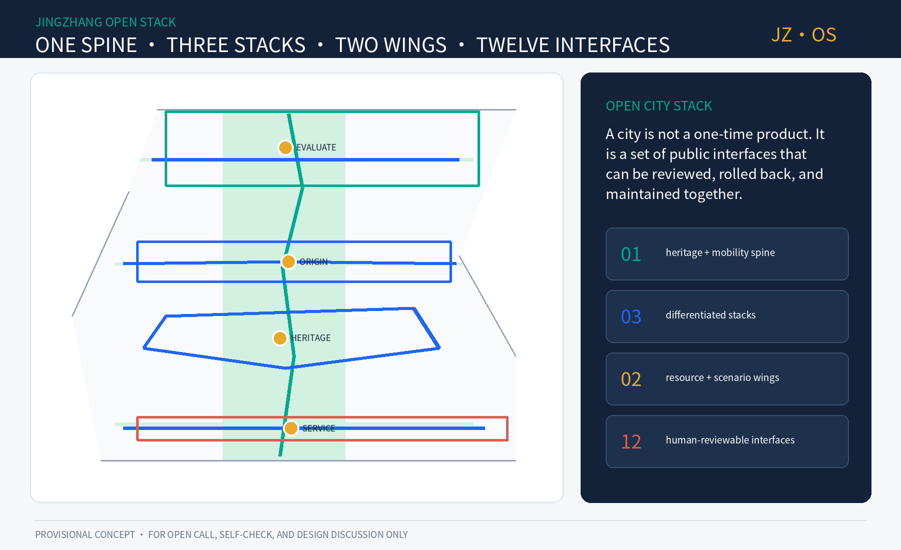
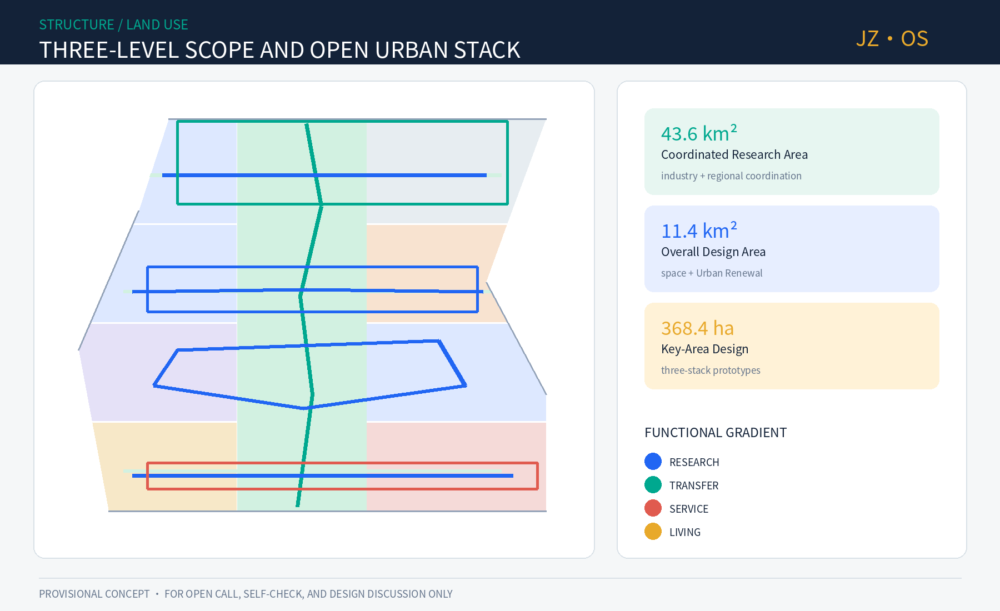
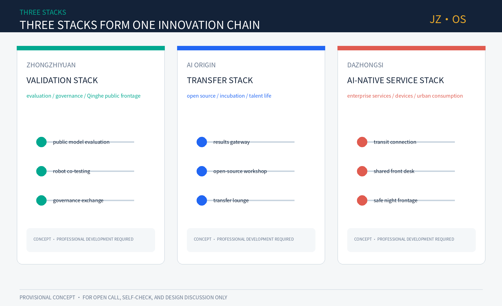
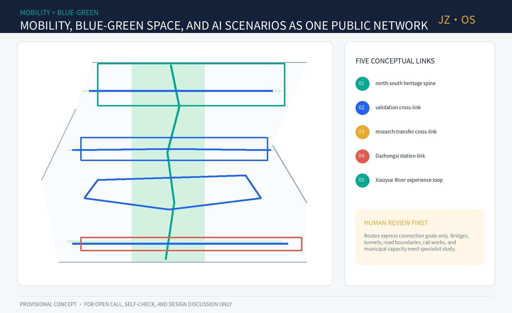
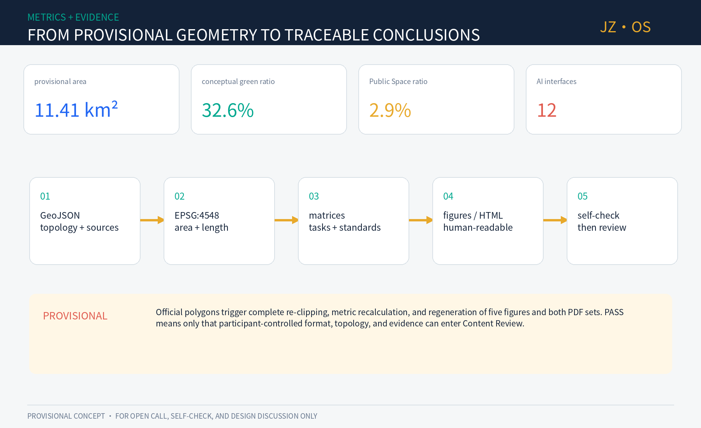

# JINGZHANG OPEN STACK: An AI Urban Spine Open to Co-Programming

> **JINGZHANG OPEN STACK / JZ·OS**: a century ago, the Jing-Zhang Railway used standard gauge, stations, and timetables to organize cooperation across places. This proposal translates that engineering spirit into open interfaces, public testing, Human Review, and traceable iteration. Every spatial move is a Conceptual Recommendation for professional teams to develop further. It is not statutory planning, government approval, or an implementation commitment.

## Design Basis and Source List

The evidence is organized in three tiers. The official announcement confirms the project objectives, the names of the three scope levels, and approximate areas; the rights-cleared Agent taskbook defines six Open Co-Creation tasks; and the Source Registry limits the permitted use of each dataset. [source:SITE-PACKAGE] [source:SOURCE-REGISTRY] [source:AGENT-TASKBOOK]

The repository's Provisional Boundary supports generation, topology checks, and presentation only. It does not replace an exact Official Planning Boundary, while the processed fact pack remains a navigation aid rather than a new authoritative source. [source:BOUNDARY-SOURCE] [source:KEY-AREA-SOURCE] [source:PROCESSED-FACT-PACK]

Local reference snapshots guide the Urban Design, Regulatory Detailed Planning, and land-use classification language. The unavailable official architectural-depth file is recorded as a data gap instead of being replaced with an unofficial mirror. [standard:MOHURD-URBAN-DESIGN-MEASURES] [standard:MOHURD-CONTROL-DETAILED-PLANNING] [standard:MNR-LAND-USE-CLASSIFICATION-GUIDE]

The announcement tasks and Agent open-call tasks are mapped in the compliance matrix; the missing architectural document remains an explicit professional follow-up item. [standard:PROJECT-OFFICIAL-ANNOUNCEMENT] [standard:PROJECT-AGENT-OPEN-CALL-TASKBOOK] [standard:MOHURD-ARCH-DESIGN-DEPTH-2016]

Available baseline material cannot support parcel-level conclusions. The diagnosis is therefore limited to structural questions supported by the taskbook: the north-south cultural line and east-west university-enterprise links still need to be stitched together; the AI ecosystem needs shared interfaces; and AI-Enabled Scenarios need exit mechanisms and Human Review. [depth:existing_conditions_diagnosis] [depth:three_level_scope_framework] [depth:overall_spatial_structure]

The complete responses for land use, renewal, mobility, infrastructure, public space, and implementation are stored in the design-depth matrix. The narrative cites only claim-adjacent evidence so the proposal remains readable. [depth:land_use_layout] [depth:traffic_rail_slow_parking] [depth:risk_missing_data]

## Three-Level Scope Framework

The approximately 43.6 km² Coordinated Research Area addresses the Three Zones and Two Wings industry ecosystem and regional coordination. The approximately 11.4 km² Overall Design Area addresses the spatial structure, Urban Renewal, mobility, infrastructure, and Public Space around Jing-Zhang Railway Heritage Park. The three Key-Area Detailed Design Areas, approximately 368.4 ha in total, become district-scale action prototypes for later professional development. [source:OFFICIAL-ANNOUNCEMENT] [standard:PROJECT-OFFICIAL-ANNOUNCEMENT] [depth:three_level_scope_framework]

The submitted overall boundary [data:geometry/site_boundary.geojson#SITE-001] and the three key areas [data:geometry/key_areas.geojson#SITE-001] come from provisional repository data and are suitable only for Intake. Their projected area [metric:site_area_sqm] is not an official precise area. Once official polygons are supplied, all land-use, green-space, Public Space, and phasing layers must be clipped again; metrics, five figures, and both PDF sets must be regenerated and professionally reviewed.

## Coordinated Research Area: Industry and Future City Research

The overall concept is **one spine, three stacks, two wings, and twelve interfaces**. The spine combines Jing-Zhang culture, Walking and Cycling Network, and public validation. The stacks specialize in full-stack validation at Zhongzhiyuan, university-research transfer at AI Origin, and AI-Native services at Dazhongsi. The two wings provide technology services and everyday Scenario Access, while twelve interfaces connect research, evaluation, transfer, public services, and cultural experience. [standard:PROJECT-AGENT-OPEN-CALL-TASKBOOK] [depth:overall_spatial_structure] [data:geometry/land_use.geojson#LU-001]

The primary name is “京张共生栈,” with the English name **JINGZHANG OPEN STACK** and short mark **JZ·OS**. Two parallel rail lines form J/Z, dots mark stations and human confirmation, and an open bracket represents plug-in interfaces. Railway teal, open-source blue, and centennial bronze form the palette. The identity uses original geometry and an open-source font, with no company logo, portrait, or unlicensed image. [source:FONT-NOTO-SC]

### Seven global cases and transferable mechanisms

| Case | Public mechanism | Translation to Jing-Zhang |
|---|---|---|
| MIT Kendall Square | Research, innovation space, retail, and public life shape an all-day district. [source:CASE-MIT-KENDALL] | Bind research space to public frontage and daily services rather than a closed campus. |
| Mila Montréal | Academic community, entrepreneurship, and responsible AI develop together. [source:CASE-MILA-MONTREAL] | Give AI Origin a continuous research-open-source-startup-ethics service chain. |
| Vector Toronto | Frontier research, talent, industry adoption, and the public sector are connected. [source:CASE-VECTOR-TORONTO] | Use the Zhongguancun Technology Services Wing as a cross-institution project bridge. |
| Singapore AI Verify | Open-source testing tools and community processes support trustworthy AI. [source:CASE-SG-AI-VERIFY] | Create publicly reviewable evaluation protocols and an exhibition corridor at Zhongzhiyuan. |
| STATION F Paris | Dense startup programs, mentors, investment, and events share one place. [source:CASE-STATION-F] | Treat shared service desks and program operations at Dazhongsi as spatial infrastructure. |
| UK AISI | Empirical evaluation studies advanced-AI risk and releases selected tools. [source:CASE-UK-AISI] | Build a public model-evaluation place that shows methods, limitations, failures, and human conclusions. |
| Hub71+ AI | Specialized resources, networks, and market access support AI startups. [source:CASE-HUB71-AI] | Share compute, data-compliance, Scenario Access, and internationalization interfaces across the stacks. |

These cases inform mechanisms only; they do not determine the project's boundary, scale, or investment. Regional coordination follows a loop of “request enters the stack - cross-area matching - public testing - evidence written back”: universities contribute research, Zhongzhiyuan provides evaluation and governance, AI Origin supports open-source transfer, Dazhongsi connects users and markets, and the two wings supply capital, talent, public services, and scenario feedback.

## Overall Design Area: Urban Renewal and Regulatory-Plan-Level Urban Design

The spatial structure does not simply attach AI labels to parcels; it creates shareable urban interfaces. The conceptual Land-Use Plan [data:geometry/land_use.geojson#LU-005] covers the full Provisional Boundary. A central green spine supports heritage, walking, cycling, and public testing, while both sides form a mixed research-transfer-service-living gradient. The conceptual 0802 research land area [metric:land_use_0802_sqm] is used only for internal comparison and does not constitute approved RDP land use. [standard:MNR-LAND-USE-CLASSIFICATION-GUIDE] [depth:land_use_layout]

The proposal does not prejudge demolition. Nine action packages follow “operations before fixed space, reversible before permanent”: an open data ledger, walking-barrier co-testing, centennial interface guide, public model-evaluation class, university-enterprise transfer lounge, shared service front desk, low-speed robot sandbox, Public Space micro-renewal, and annual Open Stack conference. [metric:renewal_project_count] The conceptual building envelopes [data:geometry/buildings.geojson#BLDG-001] test ground-floor interfaces and service capacity only. Parcel-level DRR, FAR, height, and construction scale remain pending official controls, surveys, ownership, structural-safety, and fire-safety information. [standard:MOHURD-CONTROL-DETAILED-PLANNING] [depth:retain_renovate_demolish]

Urban Character is intended to be legible without becoming excessively technological. Railway material character, continuous canopies, reversible displays, low-glare information surfaces, and tactile wayfinding form the public interface. Relationships between old and new buildings, roofs, massing, and Building Height are framed as graded review questions pending official conditions and professional design. [standard:MOHURD-URBAN-DESIGN-MEASURES] [depth:height_massing_character] [standard:MOHURD-ARCH-DESIGN-DEPTH-2016]

## Detailed Design of Key Areas

The three key areas use the rough provisional polygons in [data:geometry/key_areas.geojson#KEY-001], with the count recorded as [metric:key_area_count]. The following material combines positioning, spatial prototype, and operational mechanism; it does not represent statutory parcels or engineering alignments. [depth:three_key_area_detailed_design]

### Zhongzhiyuan: Full-Stack Validation Stack

Zhongzhiyuan becomes the public validation front desk from foundational hardware and software to safety governance. Its prototype is a four-part chain of lab units, shared evaluation hall, Qinghe public exhibition frontage, and international standards lounge. The building strategy first identifies spaces suitable for retention and adaptive reuse. The mobility strategy begins with a problem list for walking, cycling, and public-transport transfer across both sides of the Fifth Ring Road; any bridge or tunnel remains subject to engineering study. AI scenarios cover model evaluation, edge computing, robot safety, and data governance, while visitors can see the test purpose, data type, stop conditions, and human conclusion.

### Beijing AI Origin Community: University-Research Transfer Stack

AI Origin provides the first kilometer for university research to enter open-source communities and startup teams. Its prototype connects a research-results gateway, open-source workshop, shared pilot space, and talent living room. Links around Wudaokou and Qinghuadongluxikou are treated as a conceptual checklist for walking continuity, accessibility, and cycle parking. Renewal stays low-disturbance, small-scale, and mixed-time rather than relying on large demolition for image-making.

### Dazhongsi: AI-Native Service Stack

Dazhongsi becomes an urban front desk for enterprise services, intelligent devices, content consumption, and public experience. The four station quadrants combine legible paths, a shared service front desk, safe night frontage, and a low-speed delivery transfer point. Crossings, bridges, underground space, and traffic organization require separate study. Opt-in AI service assistants operate beside staffed counters to avoid invisible collection and compulsory algorithmic service.

## AI Innovation Ecosystem, Talent Profiles, and AI-Enabled Scenarios

Six user profiles guide service design: foundational researchers, startup teams, mature-company product teams, community residents, urban-operations staff, and visiting developers or members of the public. Each receives the same service promise: self-service without compulsion, understandable decisions with a reachable person, and experiments that can be stopped. [source:AGENT-TASKBOOK] [depth:existing_conditions_diagnosis]

| # | Scenario card | Type / place | Data and Human Review boundary |
|---|---|---|---|
| 01 | Public Model Evaluation Field | Industry TVS · Zhongzhiyuan | Use participant-authorized test sets, publish limitations, and require expert sign-off. |
| 02 | Low-Speed Robot Co-Test Loop | Industry TVS · green-spine nodes | Use booked periods, physical separation, on-site safety staff, and emergency stop. |
| 03 | Edge-Compute and Energy Sandbox | Industry TVS · shared facilities | Collect device-level metrics only; professional teams review energy and fire safety. |
| 04 | Walking-Barrier Co-Test | Mobility · full corridor | Accept public reports with blurred locations and add them only after field review. |
| 05 | AI Health-Service Navigation | Public service · community frontage | No diagnosis, minimum data, and transfer to people and medical institutions. |
| 06 | AI Learning-Companion Stop | Education · AI Origin | Protect minors, preserve parent/teacher choice, and provide content appeals. |
| 07 | Enterprise Compliance Desk | Industry service · two wings | Do not read trade secrets; lawyers or compliance staff confirm outputs. |
| 08 | Open-Source Results Hall | Culture · green spine | Display code, license, authorship, and risk notes together. |
| 09 | Jing-Zhang Memory Guide | Culture · heritage park | Human experts verify archive facts; a non-AI route remains available. |
| 10 | Accessible Route Assistant | Public service · transit links | User activated, with no long-term trajectory profile. |
| 11 | Multilingual Community Assistant | Public service · front desk | Disclose machine identity and transfer complex cases to staff. |
| 12 | Public-Safety Review Table | Governance · operations back office | No real-time crowd scoring; use de-identified incidents for human review. |

The twelve cards form [metric:scenario_node_count] readable interfaces, with the first three serving as industry Testing and Validation Scenarios. Operations pass through four gates: entry defines public value and responsibility; data verifies minimization and authorization; operation retains on-site staff and stop conditions; exit publishes a review and deletes unnecessary data. [depth:risk_missing_data]

## Land Use, Building Scale, and Demolish–Renovate–Retain Strategy

The Land-Use Layout describes functional relationships rather than statutory targets. A conceptual 1401 central green spine connects the stacks; 0802 research-transfer areas sit near shared interfaces; housing, community services, and commerce support daily life. Adjacent polygons share the same cut lines so they do not overlap or leave gaps. [data:geometry/land_use.geojson#LU-009] [depth:land_use_layout]

Twelve conceptual capacity envelopes appear in the building layer, with their projected footprint recorded as [metric:building_footprint_area_sqm]. They are neither surveyed existing buildings nor proposed construction quantities. Each envelope describes a possible ground-floor interface and service type. Statutory BCR, total floor area, FAR, and Building Height remain pending official RDP controls, surveys, structural safety, ownership, and fire-safety information. [data:geometry/buildings.geojson#BLDG-008] [depth:development_intensity_controls]

The DRR approach is a decision tree rather than a mapped conclusion: confirm ownership and safety; evaluate cultural and carbon value; test functional adaptability; and only then enter professional analysis for retention, repair, adaptation, or necessary reconstruction. Publicly used spaces require temporary replacement services and continuous accessibility during any work. [depth:retain_renovate_demolish]

## Transport, Rail, Municipal, and Public-Service Facilities

The conceptual mobility network consists of one north-south Walking and Cycling Network spine, three east-west stitching links, and one scenario experience loop [data:geometry/roads.geojson#ROAD-001], with total conceptual length recorded in [metric:slow_mobility_length_m]. These are connection objectives and problem lists, not road boundaries, bridges, tunnels, or rail engineering alignments. Joint field reviews should first examine junction legibility, crossing wait time, accessibility, cycle parking, night lighting, and event-day traffic. [depth:traffic_rail_slow_parking]

Municipal and New Infrastructure follow the principle that public foundations should not be locked to one supplier. Compute nodes disclose energy and service boundaries; data interfaces record licenses and retention periods; sensing devices are switchable and physically marked; and essential public services keep offline and staffed paths. Distributed energy, edge computing, communications, fire safety, and municipal capacity all require specialist calculations and receive no feasibility conclusion here. [depth:municipal_new_infrastructure]

## Blue-Green Public Space and Urban Character

Conceptual green-space area [metric:green_space_area_sqm] and ratio [metric:green_ratio] are projected from the green-space design layer. [data:geometry/green_space.geojson#GREEN-001]

Conceptual Public Space area [metric:public_space_area_sqm] and ratio [metric:public_space_ratio] are projected from the Public Space design layer. [data:geometry/public_space.geojson#PS-001] Both groups use the Provisional Boundary for internal consistency only and are not statutory indicators. [standard:MOHURD-URBAN-DESIGN-MEASURES] [depth:blue_green_public_space]

Four reversible “AI pilgrimage landmarks,” totaling [metric:landmark_count], create monumentality through public knowledge rather than oversized sculpture: the Centennial Interface Station juxtaposes railway standards and open-source protocols; the Public Model Evaluation Field shows methods and failures; the Open-Source Origin Plaza records developers, researchers, and public contributors according to license; and the City Merge Table visualizes public suggestions, professional review, and version changes.

The cultural narrative has four chapters: building the railway, making machines, writing code, and governing together. They connect self-reliant engineering in Zhan Tianyou's era, knowledge transfer in Zhongguancun, global collaboration in the open-source era, and human-centered governance in the Agent era. Sleeper rhythms, station-sign grammar, and version numbers structure the route; authoritative historical sources must verify every fact. [standard:MOHURD-URBAN-DESIGN-MEASURES] [depth:blue_green_public_space]

## Renewal Project List, Policies, and Phasing

Nine action packages are phased by reversibility [data:geometry/phasing.geojson#PHASE-001]. The near term begins with data ledgers, interpretation, walking co-tests, and movable public interfaces. The medium term, after professional review, adds university-enterprise transfer lounges, shared service desks, and controlled sandboxes. Only the long term considers fixed evaluation and international-exchange space requiring specialist study. [depth:renewal_project_list] [depth:phasing_implementation]

The suggested annual program is a spring open-source maintenance week, summer urban-scenario testing season, autumn global Open Stack conference, and winter public review and version release. Every event needs a public issue, scenario owner, risk register, public feedback, and next-year change record. The developer community uses rotating maintainers, open issues, quarterly demonstrations, and a public contribution license. International communication is measured by reusable protocols, cases, and public evaluations rather than investment announcements alone. [source:CASE-SG-AI-VERIFY] [source:CASE-STATION-F] [source:CASE-UK-AISI]

## Indicators, Area Recalculation, and Compliance Matrix

The proposal separates recalculable design indicators from statutory indicators that must remain pending. Provisional boundary, green-space, and Public Space areas and ratios are all derived from the same projected geometry and are used only for internal consistency. [metric:site_area_sqm] [metric:green_space_area_sqm] [metric:green_ratio]

Conceptual Building Footprint, walking-network length, and research land area are also recalculable, but they do not represent construction scale, road boundaries, or statutory land-use indicators. [metric:building_footprint_area_sqm] [metric:slow_mobility_length_m] [metric:land_use_0802_sqm]

Counts of key areas, scenarios, landmarks, and action packages verify task coverage. FAR, total floor area, statutory BCR, Building Height, and investment remain pending official data. [metric:key_area_count] [metric:scenario_node_count] [metric:landmark_count]

All indicators follow the same recalculation chain after official boundaries arrive, preventing selective manual changes to presentation numbers. [metric:renewal_project_count] [metric:public_space_ratio] [depth:metrics_recalculation]

The calculation chain is EPSG:4326 GeoJSON -> EPSG:4548 projection -> geometry union or length -> metrics.json -> proposal, HTML, and PDF. The compliance matrix covers announcement sections 1.3, 1.4, and 1.5 plus agent.1-agent.6; the professional standards matrix covers every mandatory standard; and the design-depth matrix covers all required formal-depth items.

## Risk, Copyright, and Legal/Official-Claim Boundaries

The largest risks are that provisional geometry is mistaken for an official conclusion, AI services create invisible surveillance, or an event concept is read as a government promise. All drawings therefore mark the provisional condition, all scenarios retain Human Review and stop/exit conditions, and every spatial, policy, funding, and timing statement remains a Conceptual Recommendation. [data:geometry/constraints.geojson#DECLARED-MISSING] [depth:risk_missing_data]

The narrative, structured data, figures, HTML, and PDFs were generated by this Agent workflow using original geometry, public or rights-cleared repository material, and the Noto Sans SC open-source font. They contain no remote image, commercial basemap, portrait, or company mark. See `report/copyright_statement.md`. Final decisions remain with people and professional teams.

## References

All principal sources and cases are registered in `sources.json`. Spatial authority descends from GeoJSON to metrics, matrices, narrative, figures, and HTML. External cases support mechanism learning only and do not support project boundaries or planning-control indicators. [source:SOURCE-REGISTRY] [source:PROCESSED-FACT-PACK]

The official announcement establishes the three scope levels, approximate areas, and design tasks. The rights-cleared taskbook establishes the Agent tasks, scenarios, identity, and operational boundaries. Local Urban Design, RDP, and land-use standards constrain professional language and evidence depth, while provisional polygons support generation, presentation, and Intake self-check only. First-party institutional pages support the seven comparative mechanisms without copying external images, logos, statistics, or spatial dimensions. None of these sources fills the missing official boundary, parcel, road, heritage, ownership, municipal, fire-safety, or existing-building information. These gaps remain in `assumptions.json`, and they determine which indicators stay pending. When official material arrives, the registry, spatial layers, metrics, matrices, narrative, and figures must be updated as one version.
